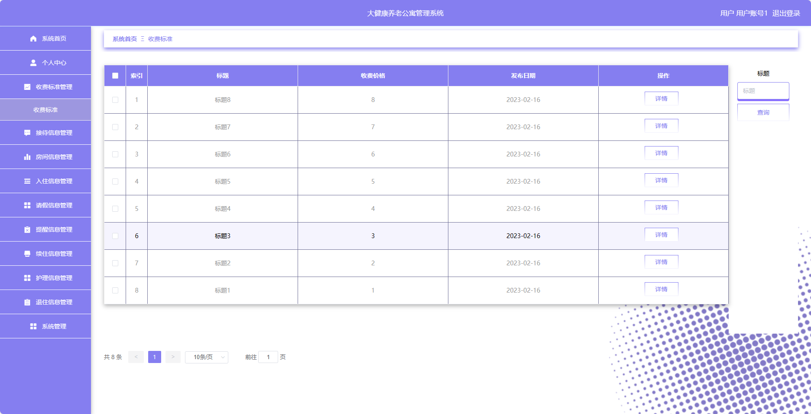
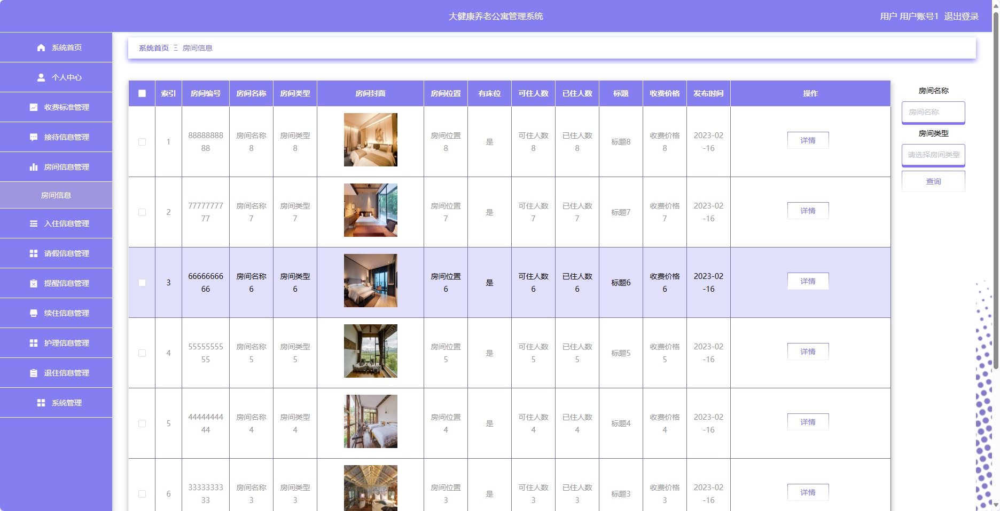
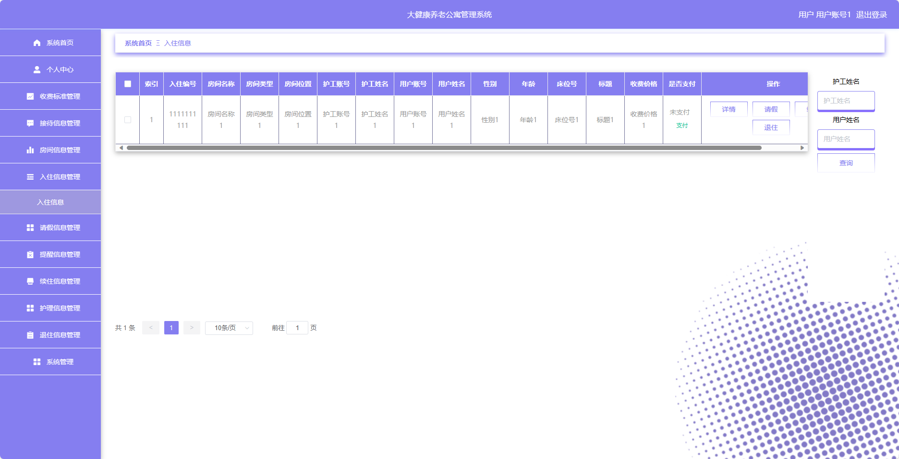
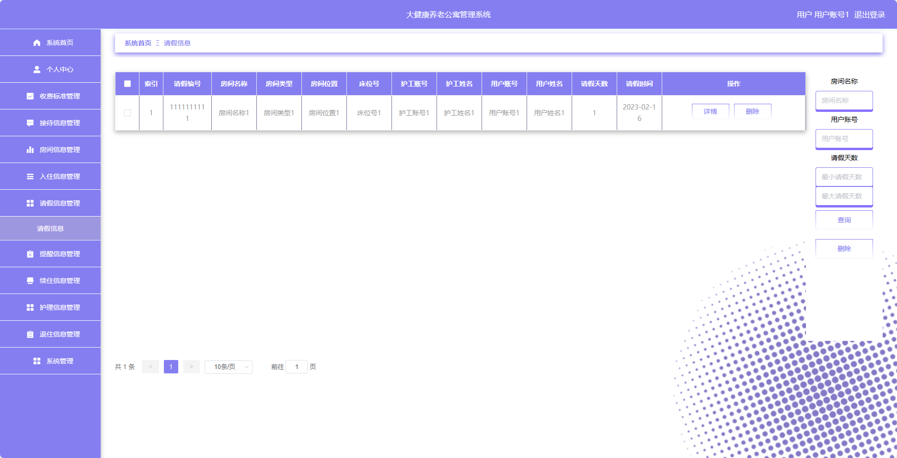
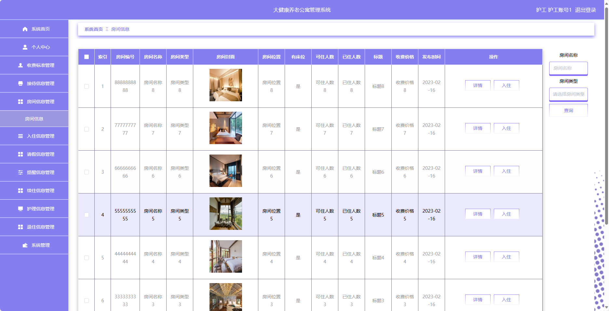
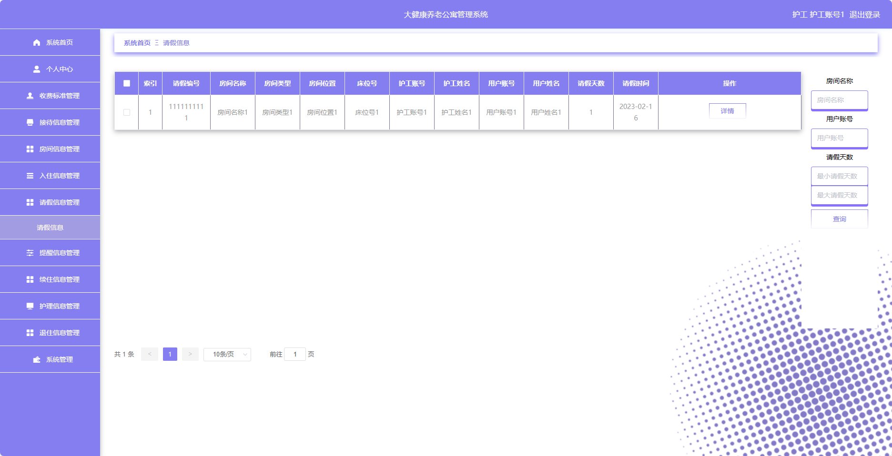
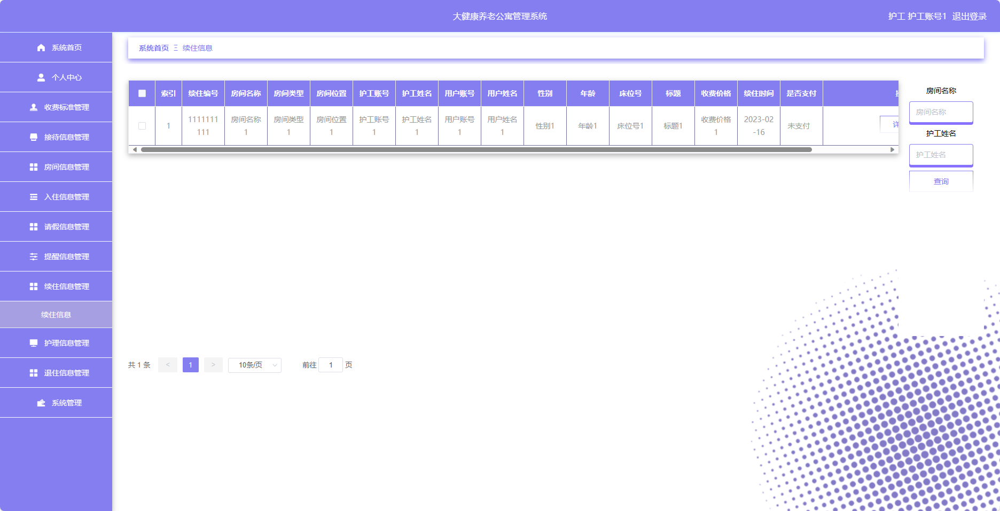

基于SpringBoot的大健康养老公寓管理系统
=
- 完整代码获取地址：从戎源码网 ([https://armycodes.com/](https://armycodes.com/))
- 作者微信：19941326836  QQ：952045282 
- 承接计算机毕业设计、Java毕业设计、Python毕业设计、深度学习、机器学习
- 选题+开题报告+任务书+程序定制+安装调试+论文+答辩ppt 一条龙服务
- 所有选题地址https://github.com/nature924/allProject

一、项目介绍
---
基于Spring Boot框架实现的大健康养老公寓管理系统，系统包含两种角色：管理员、用户,系统分为前台和后台两大模块，主要功能如下。

### 用户：
- 个人中心：管理个人信息和账户。
- 收费标准管理：查看和管理养老公寓的收费标准。
- 接待信息管理：查看和管理接待信息，包括预约接待等。
- 房间信息管理：查看和管理房间的基本信息。
- 入住信息管理：申请和管理入住信息。
- 请假信息管理：提交和管理请假申请。
- 提醒信息管理：接收和管理系统发送的提醒信息。
- 续住信息管理：申请和管理续住信息。
- 护理信息管理：查看和管理护理服务的相关信息。
- 退住信息管理：申请和管理退住信息。
- 系统管理：修改个人密码和其他系统设置。

### 护工：
- 个人中心：管理个人信息和账户。
- 收费标准管理：查看养老公寓的收费标准。
- 接待信息管理：查看和管理接待信息。
- 房间信息管理：查看和管理房间的基本信息。
- 入住信息管理：管理入住信息。
- 请假信息管理：提交和管理请假申请。
- 提醒信息管理：接收和管理系统发送的提醒信息。
- 续住信息管理：申请和管理续住信息。
- 护理信息管理：管理护理服务的相关信息。
- 退住信息管理：申请和管理退住信息。
- 系统管理：修改个人密码和其他系统设置。

### 管理员：
- 个人中心：管理个人信息和账户。
- 用户管理：管理系统中的用户信息。
- 护工管理：管理系统中的护工信息。
- 收费标准管理：管理养老公寓的收费标准。
- 接待信息管理：管理接待信息。
- 房间类型管理：管理房间的类型信息。
- 房间信息管理：管理房间的基本信息。
- 入住信息管理：管理入住信息。
- 请假信息管理：管理请假申请。
- 提醒信息管理：管理系统发送的提醒信息。
- 续住信息管理：管理续住信息。
- 护理信息管理：管理护理服务的相关信息。
- 退住信息管理：管理退住信息。
- 系统管理：修改个人密码和其他系统设置。

二、项目技术
---
- 编程语言：Java
- 数据库：MySQL
- 项目管理工具：Maven
- 前端技术：VUE、HTML、Jquery、Bootstrap
- 后端技术：Spring、SpringMVC、MyBatis

三、运行环境
---
- 操作系统：Windows、macOS都可以
- JDK版本：JDK1.8以上都可以
- 开发工具：IDEA、Ecplise、Myecplise都可以
- 数据库: MySQL5.7以上都可以
- Tomcat：任意版本都可以
- Maven：任意版本都可以

四、运行截图
---

### 程序截图：

